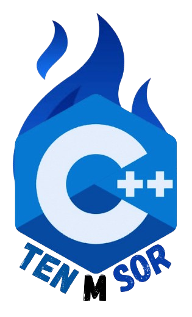

# 🚀 MTensor 2.0 is here!

**MTensor 2.0** brings a major leap over version [1.0](https://github.com/moadabdou/MTensor), with a complete redesign focused on modularity, performance, and PyTorch-like usability — all on the CPU.

Compared to the initial prototype in v1.0, this release introduces:

* A smarter `TensorImpl` architecture
* Robust autograd and computation graph support
* AVX512 fused optimizers
* Neural network training pipeline
* Dataset loaders, visualization, and more

---

## 🧠 What is MTensor?

**MTensor** is a CPU-based deep learning library written in C++, inspired by PyTorch's design. It supports dynamic graphs, training, autograd, and a wide range of tensor and neural network operations.

> ⚠️ **Beta Notice**: MTensor 2.0 is currently tested **only on Windows** with **MSVC 17 (Visual Studio 2022)**. Cross-platform support is coming soon.

---

## 🚀 Technologies Used

* **oneDNN** – High-performance tensor primitives
* **OpenMP** – Threaded parallelism
* **AVX512** – Custom fused operations for optimizers, reductions
* **CImg + libpng** – Image handling support
* **nlohmann/json** – Exporting graphs and manual tensor initialization
* **vcpkg** – Dependency manager

---

## 🧱 Features

### 🔹 Core Tensor API

* Internal `TensorImpl` with smart pointers
* Tensor methods: `shape()`, `stride()`, `numel()`, `randn()`, `ones()`, `arange()`, `fill()`, ...
* Torch-style formatted printing
* Broadcasting support (binary ops, matmul)

### 🔹 Tensor Operations

* **Arithmetic & Logic**: `+`, `-`, `*`, `/`, `<`, `>`, `==`, `min`, `max`
* **Elementwise**: `abs`, `clip`, `exp`, `log`, `pow`, `relu`, `sigmoid`, ...
* **Reduction**: `sum`, `mean`, `min`, `max`, `mul`, `norm_lp_*`, ...
* **Normalization**: `batchnorm`, `groupnorm`, `layernorm`, `rmsnorm`
* **Convolution**: `conv1d/2d/3d`, `transposedConv1d/2d/3d`
* **Pooling**: `avgpool`, `maxpool` (1d, 2d, 3d)
* **Memory & Views**: `clone`, `reshape`, `permute`, `transpose`, `squeeze`, `contiguous`
* **Matrix ops**: `matmul`, `A @ B + C`
* **Other**: `embedding`, `softmax`, `logsoftmax`, `cat()`, `stack()`

### 🔹 Autograd & Graphing

* Dynamic computation graph with `backward()`
* Tensor gradient helpers: `requires_grad`, `detach`, `grad`, ...
* Visualize autograd graph as an interactive HTML (`build_graph()`)

---

## 🧠 Neural Networks

* **Layers**: `Linear`, `Conv`, `TransposeConv`, `Embedding`, `Dropout`, `Flatten`, `Unflatten`, `Sequential`
* **Activations**: `ReLU`, `LeakyReLU`, `Sigmoid`, `Tanh`, `Softmax`, `LogSoftmax`
* **Losses**: `MSELoss`, `L1Loss`, `CrossEntropy`, `KLDiv`, `BCEWithLogits`
* **Optimizers** (AVX512-fused): `SGD`, `MomentumSGD`, `Adam`, `AdamW`
* **Initializers**: Kaiming and Xavier (Uniform/Normal)

---

## 🗂️ Data Handling

* **Datasets**:

  * `MNISTDataset` (reads MNIST binary format)
  * `ImageFolderDataset` (uses CImg for loading images)
* **Dataloader**: For training batches
* **Image I/O**: `image_to_tensor()`, `tensor_to_image()` (via CImg)

---

## ⚙️ Installation

> 🧪 MTensor 2.0 is tested on **Windows only**, with **MSVC 17 (Visual Studio 2022)**. All dependencies are managed with `vcpkg`.

---

### 1. Clone the Repository

```bash
git clone --recurse-submodules https://github.com/your-username/MTensor.git
cd MTensor
```

> ✅ `vcpkg` is included as a submodule under `external/vcpkg`.

---

### 2. Set Up vcpkg

If needed:

```bash
git submodule update --init --recursive
```

Bootstrap vcpkg:

```bash
cd external/vcpkg
./bootstrap-vcpkg.bat     # Windows
```

Install dependencies:

```bash
./vcpkg install
```

> 📦 Dependencies are defined in `vcpkg.json`.

---

### 3. Configure the Project

Use the default CMake preset (configured for Visual Studio 17 2022):

```bash
cmake --preset default
```

> 🛠️ To change generator or toolchain, edit `CMakePresets.json`.

---

### 4. Build the Project

Build in **release** mode:

```bash
cmake --build --preset release
```

Or in **debug** mode:

```bash
cmake --build --preset debug
```

> 🧪 This also builds example projects to verify functionality.

---

## 📌 Roadmap

* ✅ Tensor & autograd engine
* ✅ Neural network layers and optimizers
* ✅ Dataset/dataloader system
* 🔜 External project integration
* 🔜 Cross-platform (Linux/macOS) support
* 🔜 Python bindings
* 🔜 Training UI (browser-based)
